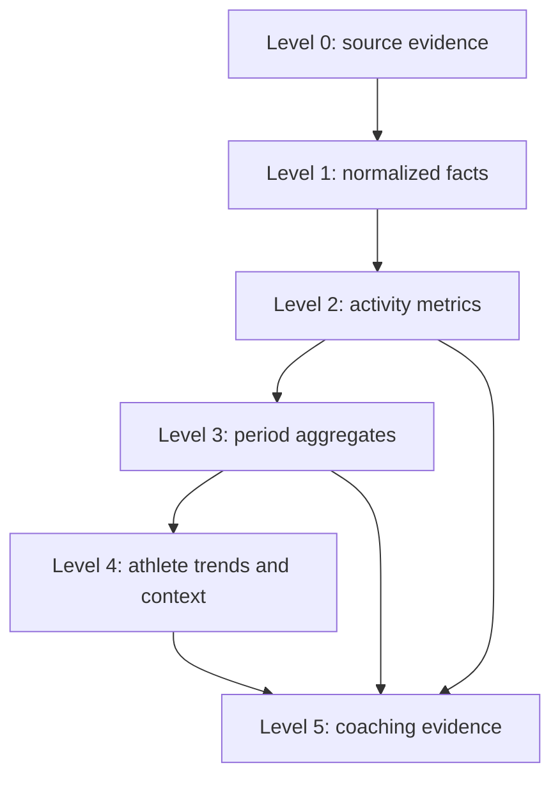

# Analytics architecture

## Status and scope

This document specifies a future provider-neutral analytics system. It does not implement calculations. Today, TriCoach AI has 1,382 stored Strava activity summaries; synchronization, the athlete dashboard, activity browsing, and summary-only detail views work. Activity evidence remains limited to imported summary fields. There are no laps, streams, maps, recovery inputs, planning data, AI features, or Coach Engine recommendations. Analytics must begin with deterministic summaries.

Analytics converts normalized facts into reproducible evidence. It does not create provider facts, infer missing measurements, diagnose health, or decide what an athlete should do. The [Coach Engine](COACH_ENGINE.md) consumes analytics through versioned `MetricResult` contracts.

## Principles

- Athlete ownership, metric units, timezone, sport scope, source provenance, and observation time are explicit.
- Missing is not zero; partial coverage travels with every result.
- Formula, parameters, windows, and missing-data policy are versioned together.
- The same facts and analysis context produce the same result.
- Provider facts are normalized before analysis; formulas never depend on Strava field names.
- Descriptive metrics precede interpretations. Experimental load or readiness metrics are labelled and never presented as medical truth.
- Simple, inspectable metrics are preferred to composite scores.

## Analytics levels

| Level | Name | Responsibility | Current availability |
|---|---|---|---|
| 0 | Source evidence | Immutable provider/user facts, provenance, timestamps, and import coverage. | Strava summaries only. |
| 1 | Normalized facts | Canonical sports, UTC/local time, SI storage units, null semantics, ownership. | Partially available for stored summaries. |
| 2 | Activity metrics | One-activity calculations without cross-session interpretation. | Basic display conversions only; catalogue below is architectural. |
| 3 | Period aggregates | Declared calendar/rolling-window totals and distributions. | Basic dashboard summaries; formal metric contracts are future work. |
| 4 | Athlete trends | Versioned comparisons against the athlete's own history and context. | Not implemented. |
| 5 | Coaching evidence | Evidence packets, observations, confidence, and uncertainty for Coach Engine rules. | Not implemented. |

Level 5 may depend on Levels 2–4 plus explicit athlete context, but lower levels must never depend on recommendations or AI wording.

## Metric catalogue conventions

“Required” means the metric is not computed without that evidence. Optional evidence may improve interpretation but never be fabricated. “Persist” is a candidate storage decision, not an implemented schema. Unless stated otherwise, missing required evidence produces no numeric value, a structured reason, and user-facing “Sin datos”; invalid values are quarantined, not coerced to zero.

Formula status values are `defined`, `needs validation`, or `research/experimental`. All target versions are proposals for Version 0.6C or later.

## Activity-level catalogue (Level 2)

| Metric | Purpose | Required evidence | Optional evidence | Sports | Frequency | Formula status | Missing-data policy | Uncertainty | Storage | User explanation | Safety | Target |
|---|---|---|---|---|---|---|---|---|---|---|---|---|
| Moving duration | Quantify active time. | Moving seconds. | Elapsed seconds. | All. | Per activity. | Defined. | Null stays missing; zero valid only for a genuine zero record. | Provider pause detection may differ. | Normalized fact or computed read. | “Tiempo registrado en movimiento.” | Not effort or fitness. | 0.6C |
| Elapsed duration | Quantify wall-clock session span. | Start/end or elapsed seconds. | Pauses. | All. | Per activity. | Defined. | Derive only from valid timestamps. | Device clock/pause gaps. | Normalized fact. | “Tiempo total desde el inicio hasta el final.” | Do not equate with active load. | 0.6C |
| Distance | Quantify covered distance. | Valid metres. | Sport subtype, GPS quality. | Endurance sports. | Per activity. | Defined. | Zero is shown; null remains missing. | Indoor/device calibration. | Normalized fact. | “Distancia registrada por la fuente.” | Location not required for display. | 0.6C |
| Elevation gain | Describe climbing. | Positive ascent metres. | Barometric/GPS source. | Run, walk, hike, cycle. | Per activity. | Needs validation. | No estimate without elevation evidence. | Device correction varies. | Fact plus provenance. | “Desnivel positivo registrado.” | Avoid precision claims. | 0.6C |
| Average speed | Describe mean movement rate. | Distance and moving duration > 0, or trusted provider value. | Sport subtype. | Cycle and meaningful others. | Per activity. | Defined. | No division by zero; null if either input absent. | Pauses and device rules. | Recompute/cache. | “Distancia dividida por tiempo en movimiento.” | Not a universal performance comparison. | 0.6C |
| Average pace | Express speed in sport-friendly units. | Valid average speed > 0. | Sport subtype. | Run/walk per km; swim per 100 m. | Per activity. | Defined. | Zero/null/invalid becomes missing. | Same source limits as speed. | Presentation derivative. | “Tiempo medio por kilómetro/100 m.” | Do not infer effort. | 0.6C |
| Best pace / maximum speed | Show reported peak performance. | Trusted max-speed or best-pace summary. | Sampling metadata. | Run, walk, swim, cycle. | Per activity. | Needs validation. | Do not invert zero or implausible values. | Summary peaks are sampling-sensitive. | Keep source fact plus display derivative. | “Mejor ritmo/velocidad registrado en el resumen.” | Avoid record claims without validation. | 0.6C |
| Average heart rate | Summarize cardiovascular measurement. | Valid HR samples or provider average. | Athlete max/rest HR, device. | Applicable sports. | Per activity. | Defined as summary. | Missing remains missing; reject impossible ranges. | Sensor coverage unknown in summaries. | Source fact with quality. | “Media de las mediciones disponibles.” | Not diagnosis or exertion proof. | 0.6C |
| Maximum heart rate | Show session peak measurement. | Valid provider maximum/samples. | Sample coverage. | Applicable sports. | Per activity. | Defined as summary. | Missing remains missing. | Artefacts and sparse sampling. | Source fact with quality. | “Máximo registrado por el sensor.” | Never diagnose from peak alone. | 0.6C |
| Average cadence | Describe movement rate. | Sport-confirmed cadence meaning. | Device/source semantics. | Cycle rpm; run steps/min when confirmed. | Per activity. | Needs validation. | Suppress ambiguous swim/source semantics. | Running may be strides or steps. | Source fact with semantic tag. | “Cadencia media con la unidad declarada.” | No technique judgment. | 0.6C |
| Average power | Summarize measured/estimated cycling work rate. | Watts plus measured/estimated provenance. | Coverage/device. | Primarily cycling. | Per activity. | Defined as summary. | Missing remains missing; literal `W`. | Estimated and measured are not equivalent. | Source fact. | “Potencia media registrada, en W.” | Not FTP or training prescription. | 0.6C |
| Weighted power | Approximate variable-effort demand. | Power series or provider-computed value with definition. | Recording gaps. | Cycling. | Per activity. | Needs validation. | Never recreate from average power. | Provider formulas may differ. | Persist source or versioned calculation. | “Potencia ponderada según el método indicado.” | Label formula; not universal load. | 0.6C/0.6B evidence |
| Relative intensity by zones | Describe time distribution against valid zones. | Samples/streams and effective-dated zones. | Threshold provenance. | HR, cycling power, run pace, swim pace. | Per activity. | Needs validation. | No zones or streams means unavailable. | Stale thresholds materially limit meaning. | Versioned derived result. | “Tiempo en cada zona usando tus zonas vigentes.” | Never auto-diagnose thresholds. | After 0.6B |
| Activity load proxy | Provide a transparent workload input. | Duration plus validated intensity evidence. | RPE. | Sport-specific. | Per activity. | Research/experimental. | No generic fallback when intensity absent. | Formula and thresholds dominate result. | Persist only with version/provenance. | “Estimación experimental basada en…” | Not fatigue, injury risk, or readiness. | Later than 0.6C |

## Weekly and period catalogue (Level 3)

| Metric | Purpose | Required evidence | Optional evidence | Sports | Frequency | Formula status | Missing-data policy | Uncertainty | Storage | User explanation | Safety | Target |
|---|---|---|---|---|---|---|---|---|---|---|---|---|
| Activity count | Show training frequency. | Deduplicated activities and period boundaries. | Activity classification. | All/by sport. | Calendar week. | Defined. | Empty complete week = 0; incomplete import = partial. | Duplicates/deletions. | Aggregate/cache. | “Número de actividades en este periodo.” | Count is not quality. | 0.6C |
| Total moving duration | Quantify weekly volume. | Valid moving durations. | Sport grouping. | All/by sport. | Week/rolling window. | Defined. | Sum known values and expose coverage; never treat null as zero silently. | Missing activities/durations. | Aggregate/cache. | “Suma del tiempo en movimiento conocido.” | Not recommended volume. | 0.6C |
| Total elapsed duration | Show total session span. | Valid elapsed durations. | — | All/by sport. | Week. | Defined. | Same coverage policy. | Pauses inflate comparisons. | Aggregate/cache. | “Suma del tiempo total registrado.” | Not active load. | 0.6C |
| Distance by sport | Show sport-specific volume. | Valid distances and canonical sport. | Indoor calibration. | Distance sports. | Week. | Defined. | Do not combine incompatible units without separate presentation. | Device calibration. | Aggregate/cache. | “Distancia acumulada por deporte.” | Cross-sport distance is not load. | 0.6C |
| Elevation gain total | Show climbing volume. | Known ascent values. | Source quality. | Land endurance. | Week. | Defined with coverage. | Partial sum labelled partial. | Device corrections. | Aggregate/cache. | “Desnivel conocido acumulado.” | Avoid false precision. | 0.6C |
| Sport distribution | Describe training composition. | Activity duration and canonical sport. | Distance. | All. | Week/4 weeks. | Defined. | Unknown sport kept as `other`; missing duration excluded and disclosed. | Short sessions by count vs duration. | Aggregate/cache. | “Cómo se reparte el tiempo entre deportes.” | Descriptive, not ideal balance. | 0.6C |
| Training-day count | Show frequency across days. | Athlete-local start dates. | Timezone history. | All. | Week. | Defined. | Incomplete window marked partial. | Travel/timezone boundary. | Aggregate/cache. | “Días con al menos una actividad.” | More days is not always better. | 0.6C |
| Rest-day count | Describe days without known activity. | Complete window and import coverage. | Planned/recovery context. | All. | Week. | Needs validation. | Never call missing-import days rest. | Unrecorded activity. | Computed read/cache. | “Días sin actividad registrada en un periodo completo.” | Not proof of recovery. | 0.6C |
| Longest session | Identify concentration of weekly volume. | Known session durations. | Sport. | All/by sport. | Week. | Defined. | Missing durations excluded and disclosed. | Partial week. | Aggregate/cache. | “Actividad con más tiempo en movimiento.” | Not automatically excessive. | 0.6C |
| Longest-session share | Show dependency on one session. | Longest and total duration > 0. | Sport scope. | All/by sport. | Week. | Defined. | No value for zero/partial denominator. | Missing sessions distort share. | Derived aggregate. | “Porcentaje del volumen concentrado en la sesión más larga.” | Contextual, not injury prediction. | 0.6C |
| Week-over-week volume change | Compare adjacent declared weeks. | Two sufficiently complete weekly totals. | Sport scope. | All/by sport. | Weekly. | Defined. | No percentage from zero baseline; show absolute change or unavailable. | Small baselines create volatility. | Derived/cache. | “Cambio respecto a la semana anterior.” | No universal safe-change threshold. | 0.6C |
| Rolling 4-week volume | Smooth short-term variation. | Four weeks with coverage. | Sport scope. | All/by sport. | Daily/weekly. | Defined. | Expose number of complete weeks. | Window and seasonality. | Derived/cache. | “Volumen conocido de las últimas cuatro semanas.” | Historical description only. | 0.6C |
| Intensity distribution | Describe time across valid zones. | Zone-tagged activity metrics and valid zones. | RPE. | Sport-specific. | Week. | Needs validation. | No implicit zone for missing samples. | Threshold staleness/coverage. | Persist versioned aggregate. | “Tiempo conocido por zona de intensidad.” | Not readiness or prescription. | After 0.6B/profile |
| Training monotony proxy | Describe similarity of daily load. | Valid daily load series for complete period. | Sport-specific load. | Defined scope only. | Weekly. | Research/experimental. | Suppress for missing days/zero variance edge cases. | Formula sensitive to load proxy. | Experimental result, versioned. | “Variación diaria estimada con método…” | Never claim injury risk. | Later |
| Training strain proxy | Combine volume/load and monotony transparently. | Valid monotony and total load. | — | Defined scope only. | Weekly. | Research/experimental. | Unavailable if either input invalid. | Compounds uncertainty. | Experimental result, versioned. | “Indicador experimental compuesto.” | Never medicalize or rank athletes. | Later |

## Athlete-level catalogue (Level 4)

| Metric | Purpose | Required evidence | Optional evidence | Sports | Frequency | Formula status | Missing-data policy | Uncertainty | Storage | User explanation | Safety | Target |
|---|---|---|---|---|---|---|---|---|---|---|---|---|
| Training consistency | Describe regularity against declared windows. | Complete activity history and timezone. | Athlete goal. | All/by sport. | Weekly/monthly. | Needs validation. | Show covered/expected windows; no moral score. | Holidays and unrecorded sessions. | Versioned trend. | “Regularidad de actividad registrada, no disciplina personal.” | Avoid shame/gamification pressure. | 0.6C |
| Frequency trend | Compare session counts over time. | Complete weekly counts. | Sport. | All/by sport. | Weekly. | Defined. | Require minimum comparable windows. | Count ignores session size. | Versioned trend. | “Cómo cambia la frecuencia registrada.” | No more-is-better claim. | 0.6C |
| Volume trend | Compare duration/distance baselines. | Complete period aggregates. | Sport/season context. | All/by sport. | Weekly. | Defined. | No trend below coverage threshold. | Window choice. | Versioned trend. | “Dirección del volumen reciente con periodo visible.” | Not fitness/readiness. | 0.6C |
| Elevation trend | Describe climbing changes. | Comparable elevation totals. | Terrain/route context. | Land endurance. | Weekly/monthly. | Needs validation. | Suppress when source quality changes. | Route/device effects. | Versioned trend. | “Cambio del desnivel registrado.” | Not performance alone. | Later |
| Long-session progression | Compare longest sport-specific sessions. | Complete weekly longest-session series. | Goal/context. | Endurance sports. | Weekly. | Defined descriptively. | Require comparable weeks and valid durations. | Event sessions/outliers. | Versioned trend. | “Evolución de la sesión más larga conocida.” | No automatic progression prescription. | 0.6C |
| Pace/speed trend | Describe changes under comparable scope. | Valid pace/speed activity metrics. | Grade, HR, weather, route, effort. | Sport-specific. | Rolling. | Needs validation. | Do not aggregate incomparable sports or invalid values. | Context confounding is high. | Computed/versioned. | “Cambio observado; terreno y esfuerzo pueden influir.” | Never declare fitness from pace alone. | Later |
| Heart-rate trend | Describe recorded HR changes in comparable sessions. | HR summaries/streams and comparability rules. | Pace/power, temperature, recovery. | Applicable. | Rolling. | Needs validation. | Suppress sparse/artefact-prone series. | Sensor/context effects. | Sensitive derived result. | “Tendencia de mediciones, no evaluación médica.” | No diagnosis. | Later |
| Power trend | Describe cycling power history. | Comparable measured/estimated watts with provenance. | Duration/zone/FTP. | Cycling. | Rolling. | Needs validation. | Keep estimated and measured separate. | Equipment/calibration changes. | Versioned trend. | “Cambio de potencia dentro de un contexto comparable.” | Not threshold diagnosis. | Later |
| Personal baseline | Provide athlete-specific comparison ranges. | Sufficient clean history and declared window. | Season/goal phase. | Metric-specific. | Recomputed periodically. | Needs validation. | No baseline below minimum evidence. | Non-stationary training. | Persist versioned baseline. | “Tu rango reciente conocido, no una norma universal.” | Avoid normative labels. | 0.6C foundation |
| Acute load | Summarize short-window workload. | Valid sport-specific load series. | RPE/recovery. | Validated sports only. | Daily. | Research/experimental. | No substitution from duration unless explicitly defined. | Window/formula sensitivity. | Experimental, versioned. | “Carga estimada de corto plazo según…” | Not readiness or injury risk. | Later |
| Chronic load | Summarize longer-window workload. | Sufficient valid load history. | Season context. | Validated sports only. | Daily/weekly. | Research/experimental. | Require minimum complete history. | Detraining/season effects. | Experimental, versioned. | “Carga histórica estimada según…” | Not fitness truth. | Later |
| Acute:chronic ratio | Compare two experimental load windows. | Compatible acute/chronic values > 0. | — | Validated scope only. | Daily/weekly. | Research/experimental. | Suppress zero denominator and low coverage. | Compounds model uncertainty. | Prefer computed-on-read; versioned if stored. | “Relación experimental entre dos ventanas.” | Must not claim injury prediction or safe zone. | Later/research gate |
| Data coverage and freshness | State whether analysis is trustworthy enough to show. | Expected window, imports, timestamps, metric inputs. | Provider sync state. | All. | Every run. | Defined. | This metric explicitly represents missingness. | Expected activity cannot be fully known. | Persist/run metadata. | “Qué datos y fechas sustentan el resultado.” | Gates unsafe overconfidence. | 0.6C |

## Sport-specific evidence dependencies

| Sport | Strong summary evidence | Evidence required for deeper metrics | Do not infer |
|---|---|---|---|
| Running/walking/hiking | Distance, moving time, elapsed time, elevation, summary HR/cadence when semantics are known. | Streams/splits for zone time, grade-aware comparisons, pauses, and stable best pace; effective pace/HR zones. | Terrain, effort, step semantics, threshold, or injury risk from pace alone. |
| Cycling | Distance, duration, elevation, summary speed, HR, cadence, watts and trainer flag with provenance. | Power/HR streams, laps, measured-vs-estimated power, equipment/calibration, effective FTP/zones. | FTP, aerodynamic performance, fatigue, or outdoor equivalence. |
| Swimming | Distance and duration where pool/open-water semantics are known. | Laps/lengths, pool length, stroke and pace samples, pauses, effective CSS/pace zones. | Stroke cadence semantics, pool length, best pace, or efficiency from generic summary cadence. |
| Strength/workout/other | Duration and canonical type. | Explicit exercise/RPE structure defined by a future domain contract. | Distance-based load, sets/reps, muscle stress, or equivalence to endurance load. |

Cross-sport totals may combine time and activity count with clear meaning. Distance, pace, cadence, power, zones, and load remain sport-specific unless an independently validated normalization contract exists.

## Storage strategy

Level 0 and necessary Level 1 facts are persisted with provenance. Cheap Level 2 presentation conversions should be computed on read. Expensive or frequently reused Level 2–4 results may be cached or persisted only when they include athlete, metric name/version, analysis context/window, value/unit, coverage, quality, input fingerprint, computed time, and supersession state.

Level 5 evidence stores references to results rather than copying sensitive series. Raw streams, if a later sprint explicitly adds them, require selective import, retention, location privacy, and deletion decisions before storage. Cache invalidation keys must include input fingerprint and formula version.

## Recalculation and versioning

Recompute when a contributing activity is inserted, updated, deleted, deduplicated, or reclassified; when timezone/window or effective athlete settings change; or when a metric version is activated. Recalculation is idempotent and bounded to affected activities/windows where possible.

Historical results are reproducible with their original version. A formula upgrade creates a new result and links the superseded one; it never silently changes an audited recommendation. Backfills are resumable and report coverage. Formula registries include definition, units, parameters, edge cases, tests, owner, approval state, effective date, and change note.

## Privacy and data minimization

- Every query and stored result is athlete-scoped; cross-athlete benchmarking is excluded.
- Derived health-adjacent and recovery data is sensitive even when source activities are public.
- Store only inputs required by an approved metric; prefer references/fingerprints to payload duplication.
- Location traces are not required for the metrics in the initial deterministic catalogue.
- Exports and deletion must include derived results, evidence links, caches, and audit-safe tombstones under a documented retention policy.
- Analytics data must not train external AI systems by default. Any later AI transfer requires explicit minimization, consent, retention, and provider review.

## Validation strategy

1. Unit tests use fixed fixtures for normal, zero, null, invalid, boundary, timezone, DST, and unit-conversion cases.
2. Property tests cover non-negative totals, permutation invariance, unit equivalence, and denominator safety.
3. Golden datasets document hand-calculated activity, week, and trend results per sport.
4. Reconciliation tests compare aggregates with included source IDs and coverage.
5. Version tests prove old outputs remain reproducible and formula upgrades produce distinct identities.
6. Provider-contract tests stop upstream schema changes from altering normalized meaning.
7. Safety tests prove missing/partial evidence blocks overconfident interpretations.
8. Statistical or research metrics require documented literature review, calibration, subgroup analysis, and product/safety approval before user exposure.

## Unresolved analytics decisions

- Canonical athlete week, travel/timezone history, and rolling-window boundaries.
- Minimum complete-history and coverage thresholds per metric.
- Source precedence for provider-computed versus locally recomputed summaries.
- Which provider values are sufficiently defined to retain as facts (notably weighted power and cadence).
- Formula selection for zone distributions, load proxies, monotony, strain, and acute/chronic load.
- Persist-versus-cache policy and operational recomputation budgets.
- Treatment of deleted/private provider activities and derived audit history.
- Effective-dated zone/threshold ownership and staleness limits.
- Comparable-session rules for pace, HR, and power trends.
- Calibration and user presentation of confidence and uncertainty.
- Privacy/retention policy for future streams and location evidence.
- Validation ownership and promotion gates from experimental to supported metrics.
- Whether and how user-reported RPE/recovery can participate without implying medical conclusions.

## Explicit exclusions

This specification adds no packages, models, migrations, endpoints, jobs, calculations, provider requests, laps, streams, maps, recovery capture, plans, recommendations, AI calls, dependencies, or behavioral changes. It does not define medical, injury-risk, readiness, or cross-athlete ranking systems.

### Version 0.6B evidence storage decision

Version 0.6B implements Level 0/1 evidence needed by later metrics: normalized laps, bounded aligned streams, provenance and coverage. Values use JSONB on PostgreSQL and JSON on SQLite behind one portable type. This is evidence storage, not a calculation layer. Downsampling metadata and checksums must be considered by future metric coverage rules; no Version 0.6C formula is implemented here.

## Version 0.6C — métricas factuales

La primera implementación de 0.6C calcula métricas deterministas sobre actividades ya importadas. Cada resultado conserva estado (`available`, `partial`, `unavailable`, `not_applicable`), unidad, fuente, muestras, cobertura, notas y motivo seguro de indisponibilidad. El algoritmo estable es `0.6c.1`.

La persistencia usa `activity_metrics`, relacionada con `completed_activities`, con unicidad por actividad, métrica y versión. Los endpoints son `GET /activities/{activity_id}/metrics` y `POST /activities/{activity_id}/metrics/recalculate`; el recálculo es aislado e idempotente.

Incluye tiempo, distancia, desnivel, velocidades, frecuencia cardiaca, potencia, cadencia, vueltas y muestras de streams. Las fuentes son resumen almacenado y streams disponibles; no se interpolan streams ausentes o desalineados. Los valores no numéricos, NaN e infinitos se descartan y nunca se convierten silenciosamente en cero.

Quedan fuera TSS, TRIMP, NP, IF, VI, GAP, SWOLF, zonas, umbrales, carga, recuperación, fatiga, readiness, coaching, recomendaciones, planificación e IA. No hay recálculo masivo automático ni worker independiente.
