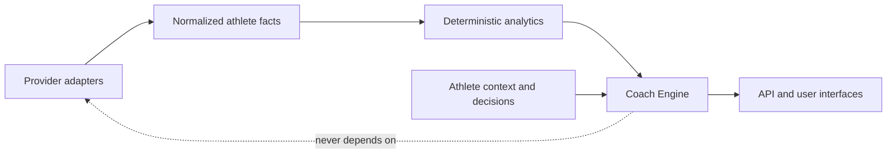
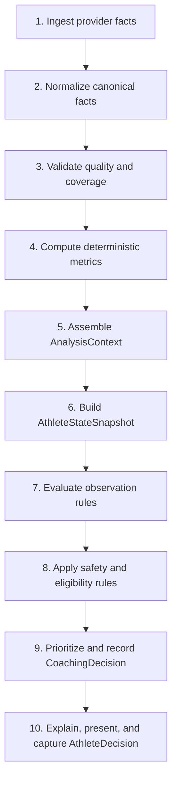
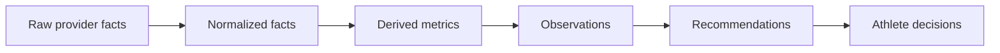
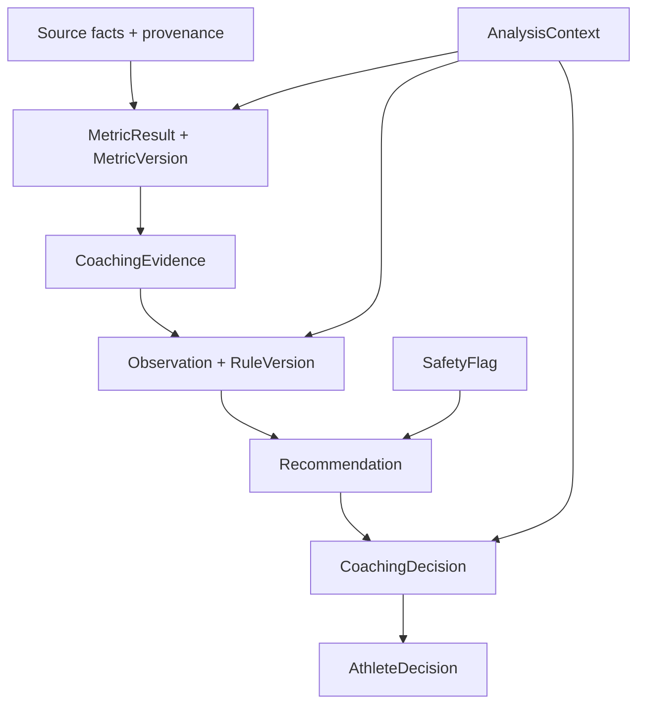

# Coach Engine architecture

## Status and purpose

This document defines the future Coach Engine contract. It is architecture, not an implemented feature. The current working dataset contains 1,382 imported Strava activity summaries; synchronization, the athlete dashboard, activity browsing, and summary-only detail views work. There are no laps, streams, maps, recovery inputs, planning features, AI features, coaching observations, or recommendations. Analytics must begin with deterministic summaries.

The Coach Engine will turn traceable athlete evidence into conservative, explainable guidance. It must preserve the difference between facts, calculations, interpretations, recommendations, and athlete decisions. It is not a medical system, an autonomous training-plan generator, or a replacement for professional care.

## Boundary and dependency direction

The engine consumes provider-neutral, athlete-owned facts. Provider adapters may supply data, but no coaching rule may depend directly on Strava response shapes or provider credentials. Product interfaces read engine outputs; they do not own calculations.

Conceptual application areas, without prescribing physical packages yet:

- `backend/app/providers`: imports external facts and provenance; owns no coaching meaning.
- `backend/app/activities`: owns normalized activity facts and their athlete boundary.
- `backend/app/analytics`: owns reproducible metrics, aggregation, coverage, and metric versions.
- `backend/app/coach/evidence`: assembles immutable evidence references and analysis context.
- `backend/app/coach/observations`: evaluates versioned deterministic rules.
- `backend/app/coach/recommendations`: prioritizes safe, bounded recommendations.
- `backend/app/coach/explanations`: produces templates first and optional AI wording later.
- `backend/app/coach/safety`: applies suppression, escalation, and non-medical guardrails.
- `frontend`: presents evidence, confidence, uncertainty, and athlete choices; it does not recalculate them.

Dependency direction is inward: integrations and interfaces depend on stable application contracts; coaching depends on normalized facts and analytics, never the reverse. Analytics must remain usable without the Coach Engine.

## Inputs, outputs, and ownership

Inputs may include normalized activity summaries, later enrichment, weekly aggregates, effective-dated athlete settings, explicit goals, availability, recovery reports, and prior athlete decisions. Every input carries athlete ownership, source, observation time, ingestion time, coverage, and relevant version identifiers.

Outputs are observations, safety flags, and recommendations with evidence references, confidence, uncertainty reasons, calculation/rule versions, creation time, expiry/review time, and lifecycle state. Outputs belong to one athlete. Imported facts remain owned by their source modules; analytics owns metric results; the Coach Engine owns interpretations and recommendations; the athlete owns acceptance, rejection, deferral, and feedback decisions.

No layer silently rewrites an earlier layer. Corrections produce new versions or recomputed outputs with an audit relationship to the superseded result.

## Core concepts

Each concept below is provider-neutral and athlete-scoped.

### CoachingEvidence

- **Definition and purpose:** An immutable reference to a fact or result used to support an observation or decision; provides the audit trail.
- **Required inputs / output fields:** Evidence source identifier and version; emits `evidence_id`, `athlete_id`, `kind`, `source_ref`, `observed_at`, `captured_at`, `provenance`, and optional excerpt/coverage.
- **Lifecycle / ownership:** Created when analysis is assembled, retained with dependent outputs, invalidated only by explicit source correction; Coach Engine evidence layer.
- **Classification:** Deterministic. Example: the versioned weekly cycling-duration result for 6–12 July.

### MetricResult

- **Definition and purpose:** A reproducible numeric, categorical, or interval calculation with units and coverage.
- **Required inputs / output fields:** Normalized facts plus a metric definition; emits value, unit, period, sport scope, coverage, quality flags, `metric_version`, and input references.
- **Lifecycle / ownership:** Computed, cached or persisted, recomputed after relevant input/version changes, superseded rather than mutated; analytics.
- **Classification:** Deterministic. Example: `weekly_duration=312 min`, coverage 7/7 days.

### ActivityObservation

- **Definition and purpose:** An interpretation limited to one activity, not a raw metric or recommendation.
- **Required inputs / output fields:** Activity facts and metric results; emits observation type, statement key, evidence, confidence, uncertainty, rule version, severity, and validity.
- **Lifecycle / ownership:** Generated after activity analysis, refreshed when evidence changes, expires when no longer useful; Coach Engine observations.
- **Classification:** Deterministic first. Example: “This ride was longer than the athlete's recent cycling median,” with the comparison window shown.

### WeeklyObservation

- **Definition and purpose:** An interpretation of a declared calendar or rolling week.
- **Required inputs / output fields:** Weekly metrics, timezone, week definition, and coverage; emits the same trace fields as an activity observation plus period boundaries.
- **Lifecycle / ownership:** Generated after weekly aggregation and superseded on recomputation; Coach Engine observations.
- **Classification:** Deterministic first. Example: “Running frequency increased from 3 to 4 sessions,” not “fitness improved.”

### AthleteStateSnapshot

- **Definition and purpose:** A time-bounded view of known training context used consistently by one analysis run.
- **Required inputs / output fields:** Latest valid metrics, zones, goals, availability, recovery inputs, and safety context; emits `as_of`, effective input versions, coverage, staleness, and state facets.
- **Lifecycle / ownership:** Immutable snapshot per analysis context; rebuilt rather than edited; Coach Engine assembly layer.
- **Classification:** Deterministic assembly. Example: state as of Monday 06:00 with four weeks of complete activities but no recovery report.

### Recommendation

- **Definition and purpose:** A bounded, optional coaching action proposed to the athlete; never an autonomous change.
- **Required inputs / output fields:** Eligible observations, athlete state, safety flags, and priority policy; emits action key, rationale, evidence, priority, confidence, uncertainty, scope, expiry, and lifecycle status.
- **Lifecycle / ownership:** Proposed, presented, accepted/rejected/deferred, expired, withdrawn, or superseded; Coach Engine, with athlete-owned response.
- **Classification:** Deterministic eligibility and prioritization initially; AI may later phrase an already-approved action. Example: suggest keeping the next easy run easy after a sharp volume increase, conditional on complete evidence.

### RecommendationEvidence

- **Definition and purpose:** The explicit many-to-many link explaining which evidence supports or opposes a recommendation.
- **Required inputs / output fields:** Recommendation and CoachingEvidence identifiers; emits relationship (`supports`, `contradicts`, `context`), weight category, and explanation key.
- **Lifecycle / ownership:** Created atomically with a recommendation and retained for audit; Coach Engine recommendations.
- **Classification:** Deterministic. Example: two complete weekly totals support an increase observation while a missing recovery report is contextual uncertainty.

### RecommendationPriority

- **Definition and purpose:** A transparent ordering category, not an opaque score.
- **Required inputs / output fields:** Safety severity, time sensitivity, goal relevance, confidence, and collision policy; emits named band (`safety`, `high`, `normal`, `low`) plus reason keys.
- **Lifecycle / ownership:** Re-evaluated when context changes; Coach Engine policy.
- **Classification:** Deterministic. Example: a pain-related stop-and-seek-help safety message outranks progression guidance.

### Confidence

- **Definition and purpose:** An assessment of evidential support, distinct from predicted outcome probability.
- **Required inputs / output fields:** Coverage, freshness, source quality, agreement, and rule applicability; emits named level, contributing factors, and method version.
- **Lifecycle / ownership:** Calculated with each observation/recommendation and recomputed with evidence; analytics/Coach Engine contract.
- **Classification:** Deterministic bands initially. Example: `low` because only one of four comparison weeks is complete.

### UncertaintyReason

- **Definition and purpose:** A structured explanation of what is unknown or limits interpretation.
- **Required inputs / output fields:** Missingness and quality checks; emits code, user-facing explanation key, affected scope, and whether it blocks output.
- **Lifecycle / ownership:** Attached while applicable and removed only through recomputation; originating analysis layer.
- **Classification:** Deterministic. Example: `MISSING_HEART_RATE` or `PARTIAL_IMPORT_WINDOW`.

### RuleVersion

- **Definition and purpose:** Immutable identity of an observation, eligibility, priority, or safety rule implementation and parameters.
- **Required inputs / output fields:** Rule name, semantic version, parameter set, effective dates, and change note; emits a stable reference stored on outputs.
- **Lifecycle / ownership:** Registered, activated, retired; old versions remain auditable; Coach Engine policy owner.
- **Classification:** Deterministic metadata. Example: `weekly-volume-change/v1.1.0`.

### MetricVersion

- **Definition and purpose:** Immutable identity of a metric formula, units, window, and missing-data policy.
- **Required inputs / output fields:** Metric specification and implementation version; emits stable name/version and compatibility metadata.
- **Lifecycle / ownership:** Registered, activated, retired, and used to trigger selective recomputation; analytics.
- **Classification:** Deterministic metadata. Example: `acute-chronic-duration-ratio/v0.1.0`, explicitly experimental.

### AnalysisContext

- **Definition and purpose:** The reproducibility envelope for one analysis execution.
- **Required inputs / output fields:** Athlete, `as_of`, timezone, locale, week/window definitions, input cutoff, rule set, metric set, and run ID; emits a frozen context reference.
- **Lifecycle / ownership:** Created per run and retained with results; orchestration layer.
- **Classification:** Deterministic. Example: Europe/Madrid, ISO week, inputs received before 2026-07-15T08:00Z.

### SafetyFlag

- **Definition and purpose:** A non-diagnostic condition that suppresses, limits, or escalates coaching output.
- **Required inputs / output fields:** Explicit athlete reports and validated safety rules; emits category, severity, evidence, prescribed handling, expiry, and rule version.
- **Lifecycle / ownership:** Open, acknowledged, resolved, expired; safety layer, with athlete control over reports.
- **Classification:** Deterministic rules; no AI inference of medical conditions. Example: reported chest pain suppresses training progression advice and directs urgent professional assessment.

### CoachingDecision

- **Definition and purpose:** The engine's traceable selection among eligible recommendations at a point in time.
- **Required inputs / output fields:** Candidate recommendations, conflicts, priorities, safety flags, and context; emits selected, suppressed, and deferred candidates with reason codes.
- **Lifecycle / ownership:** Immutable decision record per run; Coach Engine orchestration.
- **Classification:** Deterministic initially. Example: suppress a volume-increase suggestion because the import window is incomplete.

### AthleteDecision

- **Definition and purpose:** The athlete's explicit response to a recommendation; preserves human authority.
- **Required inputs / output fields:** Recommendation ID and authenticated athlete action; emits accepted/rejected/deferred/dismissed status, time, optional reason, and consent-safe feedback.
- **Lifecycle / ownership:** Appended as an auditable event; correction is another event; athlete-owned.
- **Classification:** Human input, never AI. Example: “Deferred until Friday due to work.”

## Processing pipeline

1. Preserve raw provider facts and source timestamps without adding coaching meaning.
2. Map them into provider-neutral, unit-safe facts.
3. Identify invalid, stale, duplicated, missing, and partial evidence.
4. Calculate versioned metrics with declared windows and missing-data policies.
5. Freeze time, locale, timezone, cutoff, and version choices.
6. Assemble only evidence valid at the context's `as_of` time.
7. Produce observations; do not jump directly from a provider fact to advice.
8. Suppress unsafe or unsupported candidates and attach uncertainty.
9. Resolve conflicts using visible priority categories and retain rejected candidates.
10. Render a plain-language explanation and record the athlete's independent choice.

## Strict information separation

- Raw facts preserve provider payload meaning and provenance.
- Normalized facts resolve units, canonical sport/type, timestamps, and ownership.
- Derived metrics state formula, window, units, coverage, and metric version.
- Observations interpret evidence under a rule version and analysis context.
- Recommendations propose bounded actions and show supporting and opposing evidence.
- Athlete decisions never rewrite evidence and must remain reversible at the product level.

## Deterministic logic and later AI assistance

Deterministic logic owns arithmetic, thresholds, eligibility, conflicts, priority, confidence bands, uncertainty, safety suppression, and the final set of allowable recommendations. Initial explanations use reviewed templates.

Examples include weekly duration and frequency, longest-session comparison, monotony inputs, zone distributions where zones are known, missing-data detection, gradual-change rules, and recommendation expiry. The same inputs, context, metric versions, and rule versions must produce the same result.

A later language model may summarize already-computed evidence, adapt tone, translate an approved explanation, or answer questions using a constrained evidence packet. It must not invent metrics, diagnose health, silently change rule outcomes, select unsafe actions, access provider secrets, or write plans without an explicit product contract and athlete confirmation. Its prompt/model/version and evidence IDs must be auditable; a deterministic fallback explanation is mandatory.

## Provenance, reproducibility, and audit

Every output must answer: whose data, which source facts, which formula and rule, what time/window/timezone, what was missing, why the output was allowed, and whether the athlete acted. Re-analysis creates a new run linked to superseded outputs. Audit records contain identifiers and decisions, not unnecessary copies of sensitive payloads.

## Missing data and uncertainty policy

- Missing is not zero. Unknown duration, heart rate, power, recovery, or zone context remains unknown.
- Coverage is part of the result and visible to rules and users.
- Low coverage may lower confidence, narrow language, or block a recommendation.
- Conflicting sources remain attributed; precedence must be explicit, never accidental.
- Staleness uses metric-specific thresholds. A stale threshold or zone cannot silently personalize current guidance.
- The interface explains the practical consequence: for example, “Two activities may be missing, so no weekly increase recommendation was generated.”

## Recommendation safety and user explanation

Recommendations must be optional, scoped, time-bounded, conservative, and phrased as guidance. They show the relevant evidence, comparison window, confidence, uncertainty, and a “why am I seeing this?” explanation. Users can dismiss or defer without penalty.

The system must not diagnose, prescribe treatment, claim injury prevention, or present a computed score as medical truth. Explicit severe symptoms, pain, illness, or crisis signals invoke reviewed messaging that stops training guidance and directs appropriate professional or emergency support. Ambiguous absence of data must never be treated as absence of risk.

## Unresolved architecture decisions

These decisions require ADRs, product review, and evidence before implementation:

1. Which outputs are computed on read, asynchronously cached, or persisted.
2. The canonical week definition and athlete-timezone behavior after travel.
3. Minimum history and coverage required for each observation and recommendation.
4. Whether confidence uses named bands only or also exposes a calibrated numeric value.
5. Rule and metric semantic-version compatibility and recomputation triggers.
6. Retention periods for evidence, decisions, and superseded results.
7. How athlete-entered facts override or coexist with provider facts.
8. Conflict resolution when goals, availability, recovery, and training evidence disagree.
9. Which safety flags block all guidance versus only a recommendation category.
10. Governance, review, evaluation, and rollback for rule changes.
11. The permitted later AI provider, data boundary, prompt retention, and opt-in model.
12. Whether AI-generated wording needs pre-publication review or post-generation validation.
13. How explanation usefulness and recommendation outcomes are evaluated without optimizing for harmful engagement.

## Explicit exclusions from this architecture deliverable

No engine packages, database tables, migrations, endpoints, jobs, provider requests, metric calculations, recommendations, AI calls, UI behavior, or new dependencies are introduced by this document.

