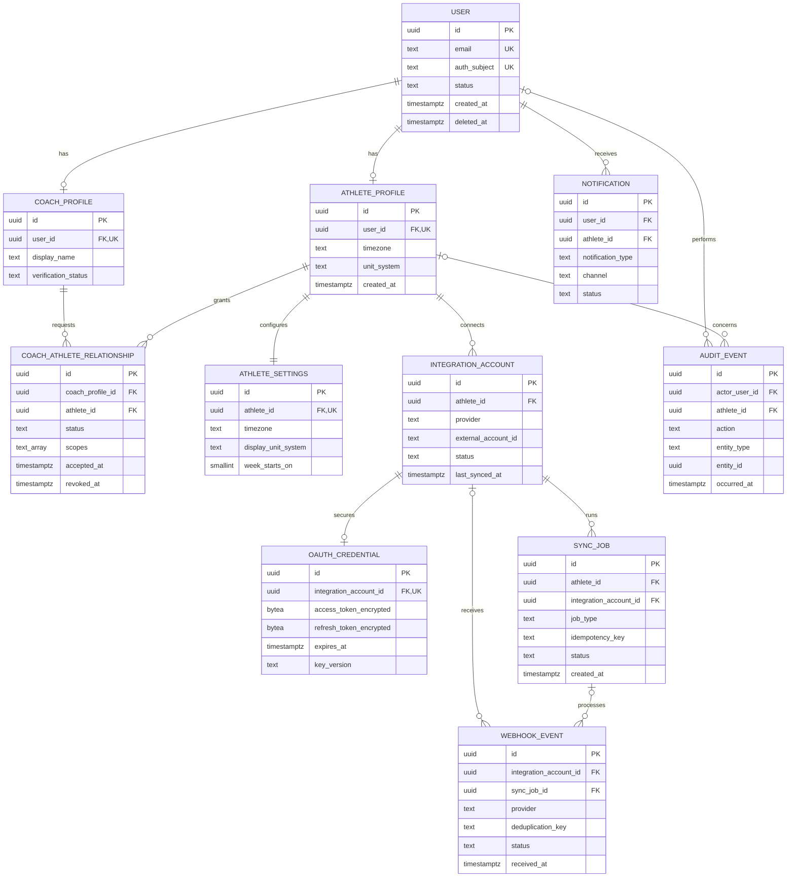
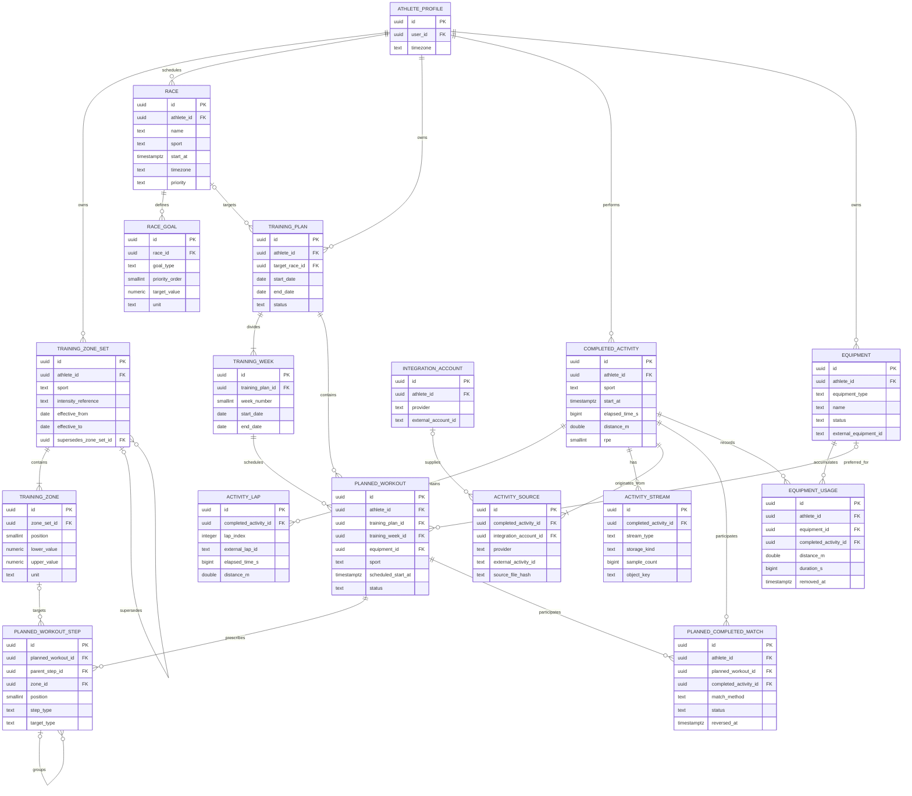
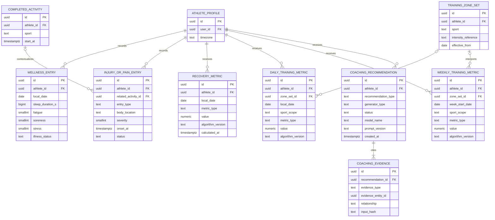

# Triathlon Coach Entity-Relationship Diagrams

These diagrams describe the conceptual relationships in [DATA_MODEL.md](DATA_MODEL.md). They are split by logical area for readability. UUID fields are internal keys; fields ending in `external_id` are alternate provider identities, never primary keys. The diagrams do not prescribe SQLAlchemy or migration implementation.

Mermaid cardinality legend: `||` exactly one, `o|` zero or one, `|{` one or more, and `o{` zero or more.

## Complete conceptual model: identity and integrations

`CoachAthleteRelationship` is the consent boundary, not merely a membership join. `OAuthCredential` is isolated one-to-one from the athlete-visible integration record. Webhooks form an idempotent inbox and may create a retryable sync job. Notifications and coach collaboration are not MVP requirements, but their ownership boundaries are reserved.

## Complete conceptual model: planning, activities, and equipment

A plan optionally targets a race and groups weeks/workouts. A completed activity never belongs to a plan directly. The reversible match entity links plan to execution and permits suggested, confirmed, and reversed states. Activity sources hold external identities; equipment usage is derived from activity assignments rather than a mutable total.

## Complete conceptual model: wellness, metrics, and coaching

Wellness and pain are source evidence, while recovery/daily/weekly metric rows are reproducible deterministic outputs with algorithm versions. Recommendations are interpretations or proposals and cannot masquerade as deterministic metrics. Every future AI recommendation has one or more evidence links; access to each link is limited by the source evidence's privacy class.

## Simplified MVP-only diagram

This view omits future coach/AI records, post-MVP streams/notifications, and most operational detail. It shows the minimum product path from one user through planning, synchronization, completed training, recovery, and analysis.

```mermaid
erDiagram
    USER ||--|| ATHLETE_PROFILE : owns
    ATHLETE_PROFILE ||--|| ATHLETE_SETTINGS : configures
    ATHLETE_PROFILE ||--o{ INTEGRATION_ACCOUNT : connects
    INTEGRATION_ACCOUNT ||--o| OAUTH_CREDENTIAL : secures
    INTEGRATION_ACCOUNT ||--o{ SYNC_JOB : synchronizes
    INTEGRATION_ACCOUNT ||--o{ WEBHOOK_EVENT : receives
    ATHLETE_PROFILE ||--o{ TRAINING_ZONE_SET : versions
    TRAINING_ZONE_SET ||--|{ TRAINING_ZONE : contains
    ATHLETE_PROFILE ||--o{ RACE : schedules
    RACE ||--o{ RACE_GOAL : defines
    ATHLETE_PROFILE ||--o{ TRAINING_PLAN : owns
    RACE o|--o{ TRAINING_PLAN : targets
    TRAINING_PLAN ||--|{ TRAINING_WEEK : divides
    TRAINING_WEEK ||--o{ PLANNED_WORKOUT : schedules
    PLANNED_WORKOUT ||--o{ PLANNED_WORKOUT_STEP : prescribes
    ATHLETE_PROFILE ||--o{ COMPLETED_ACTIVITY : performs
    COMPLETED_ACTIVITY ||--o{ ACTIVITY_LAP : contains
    COMPLETED_ACTIVITY ||--|{ ACTIVITY_SOURCE : originates_from
    PLANNED_WORKOUT ||--o{ PLANNED_COMPLETED_MATCH : links
    COMPLETED_ACTIVITY ||--o{ PLANNED_COMPLETED_MATCH : links
    ATHLETE_PROFILE ||--o{ EQUIPMENT : owns
    EQUIPMENT ||--o{ EQUIPMENT_USAGE : accumulates
    COMPLETED_ACTIVITY ||--o{ EQUIPMENT_USAGE : records
    ATHLETE_PROFILE ||--o{ WELLNESS_ENTRY : records
    ATHLETE_PROFILE ||--o{ INJURY_OR_PAIN_ENTRY : records
    ATHLETE_PROFILE ||--o{ RECOVERY_METRIC : derives
    ATHLETE_PROFILE ||--o{ DAILY_TRAINING_METRIC : derives
    ATHLETE_PROFILE ||--o{ WEEKLY_TRAINING_METRIC : derives
    USER ||--o{ AUDIT_EVENT : performs

    USER {
        uuid id PK
    }
    ATHLETE_PROFILE {
        uuid id PK
        uuid user_id FK
    }
    ATHLETE_SETTINGS {
        uuid id PK
        uuid athlete_id FK
    }
    INTEGRATION_ACCOUNT {
        uuid id PK
        uuid athlete_id FK
        text external_account_id
    }
    OAUTH_CREDENTIAL {
        uuid id PK
        uuid integration_account_id FK
    }
    SYNC_JOB {
        uuid id PK
        uuid integration_account_id FK
    }
    WEBHOOK_EVENT {
        uuid id PK
        text deduplication_key UK
    }
    TRAINING_ZONE_SET {
        uuid id PK
        uuid athlete_id FK
    }
    TRAINING_ZONE {
        uuid id PK
        uuid zone_set_id FK
    }
    RACE {
        uuid id PK
        uuid athlete_id FK
    }
    RACE_GOAL {
        uuid id PK
        uuid race_id FK
    }
    TRAINING_PLAN {
        uuid id PK
        uuid athlete_id FK
    }
    TRAINING_WEEK {
        uuid id PK
        uuid training_plan_id FK
    }
    PLANNED_WORKOUT {
        uuid id PK
        uuid athlete_id FK
    }
    PLANNED_WORKOUT_STEP {
        uuid id PK
        uuid planned_workout_id FK
    }
    COMPLETED_ACTIVITY {
        uuid id PK
        uuid athlete_id FK
    }
    ACTIVITY_LAP {
        uuid id PK
        uuid completed_activity_id FK
    }
    ACTIVITY_SOURCE {
        uuid id PK
        uuid completed_activity_id FK
        text external_activity_id
    }
    PLANNED_COMPLETED_MATCH {
        uuid id PK
        uuid planned_workout_id FK
        uuid completed_activity_id FK
    }
    EQUIPMENT {
        uuid id PK
        uuid athlete_id FK
    }
    EQUIPMENT_USAGE {
        uuid id PK
        uuid equipment_id FK
        uuid completed_activity_id FK
    }
    WELLNESS_ENTRY {
        uuid id PK
        uuid athlete_id FK
    }
    INJURY_OR_PAIN_ENTRY {
        uuid id PK
        uuid athlete_id FK
    }
    RECOVERY_METRIC {
        uuid id PK
        uuid athlete_id FK
        text algorithm_version
    }
    DAILY_TRAINING_METRIC {
        uuid id PK
        uuid athlete_id FK
        text algorithm_version
    }
    WEEKLY_TRAINING_METRIC {
        uuid id PK
        uuid athlete_id FK
        text algorithm_version
    }
    AUDIT_EVENT {
        uuid id PK
        uuid actor_user_id FK
    }
```

The MVP still stores athlete ownership explicitly, even for a single athlete. This makes athlete-scoped authorization, export, deletion, and future multi-athlete support possible without changing core keys.
